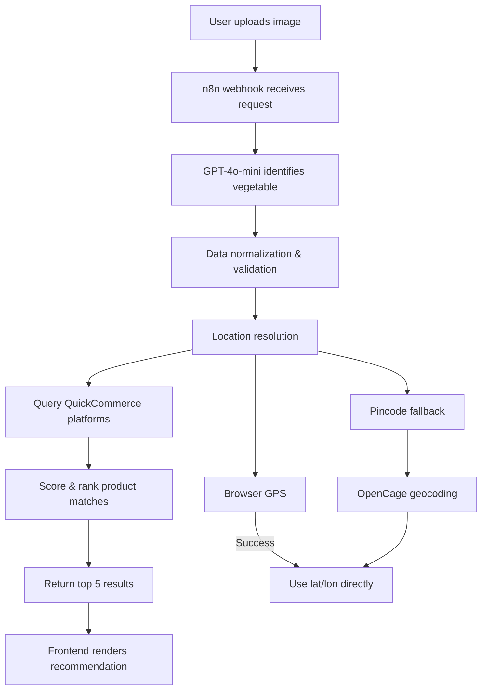

# 🟢 ProductLens — AI Grocery Price Scanner

> Scan a product. Instantly find the best price across Blinkit, Zepto, Swiggy Instamart, and BigBasket.

---

## 🌿 Overview

**ProductLens** is an AI-powered price intelligence system that lets users:

- Upload an image of a vegetable 📸
- Automatically detect the item using AI 🤖
- Compare real-time prices across multiple quick-commerce platforms 🛒
- Receive the best recommendation based on price + relevance ⚡

No manual searching. No app hopping. Just scan → decide.

---

## 🧠 How It Works



---

## ⚙️ Tech Stack

| Layer | Technology | Purpose |
|---|---|---|
| Orchestration | `n8n` | Workflow automation, webhook orchestration, API integration, data routing |
| Vision | `GPT-4o-mini` | Image-based vegetable recognition and normalized product naming |
| Pricing | `QuickCommerce API` | Real-time pricing from Blinkit, Zepto, Swiggy Instamart, BigBasket |
| Location | `OpenCage API` | Fallback geocoding from pincode to latitude/longitude |
| Frontend | HTML, CSS, JavaScript | Lightweight UI for scanning and displaying results |

---

## 📍 Location Resolution

ProductLens resolves location with a reliable fallback path:

1. Browser GPS is used first.
2. If GPS is blocked or unavailable, the user enters a pincode.
3. `OpenCage` converts that pincode into latitude and longitude.
4. The geocoded coordinates feed the pricing request for hyperlocal accuracy.

| Step | Source | Result |
|---|---|---|
| Primary | Browser GPS | Direct latitude/longitude from the user device |
| Fallback | Pincode input | Fallback location entry when GPS fails |
| Geocoding | OpenCage API | Converts pincode to valid lat/lon coordinates |

---

## ✨ Features

| Feature | Benefit |
|---|---|
| Image upload / camera capture | Quick produce scanning without typing |
| AI-based item detection | Eliminates manual product search and guesswork |
| Quantity selection | Standardizes 250g, 500g, and 1kg comparisons |
| Location fallback | Ensures pricing works even when GPS is unavailable |
| Real-time rendering | Fast display of the best matching results |
| Ranked recommendations | Balances relevance, quality, and price efficiency |

---

## 🧪 Intelligence Layer (Core Innovation)

ProductLens is designed to make decisions, not just list prices.

- ✅ Strict vegetable matching: only relevant produce is shown
- ❌ Noise reduction: filters out chips, masala, ketchup, processed foods
- ⚖️ Quantity normalization: converts all pricing to ₹/kg for consistent comparison
- 🧠 Smart scoring: ranks by name relevance, simplicity, quantity match, and price efficiency

---

## ⭐ Output

- Top 5 matching product listings
- Best recommendation based on matched relevance and value

---

## 🚀 Setup Guide

1. Clone the repo

```bash
git clone https://github.com/your-username/productlens
cd productlens
```

2. Setup `n8n`
- Open `n8n`
- Import `ProductLens.json`
- Add credentials:
  - OpenAI API key
  - QuickCommerce API key
- Activate the workflow

3. Update the webhook URL in `index.html`

```js
const WEBHOOK_URL = "https://your-n8n-domain/webhook/vegetable-price-check";
```

4. Add OpenCage API key

```js
const OPENCAGE_API_KEY = "your-api-key";
```

5. Run
- Open `index.html` in your browser
- Upload an image → get results 🚀

---

## ⚠️ Common Issues

- Using `/webhook-test/` instead of `/webhook/`
- Passing latitude/longitude as strings instead of numbers
- `Merge` node returning stale data in `n8n`
- API returning fuzzy results (handled by the custom logic layer)

---

## 🌱 Future Scope

- Price history tracking
- ML-based price prediction
- Cart optimization across platforms
- Nearby store clustering
- Price alerts

---

## 🧭 Vision

Searching is outdated. The future is systems that decide for you.

---

## 👤 Author

Built with intent, logic, and a refusal to settle for average systems.
